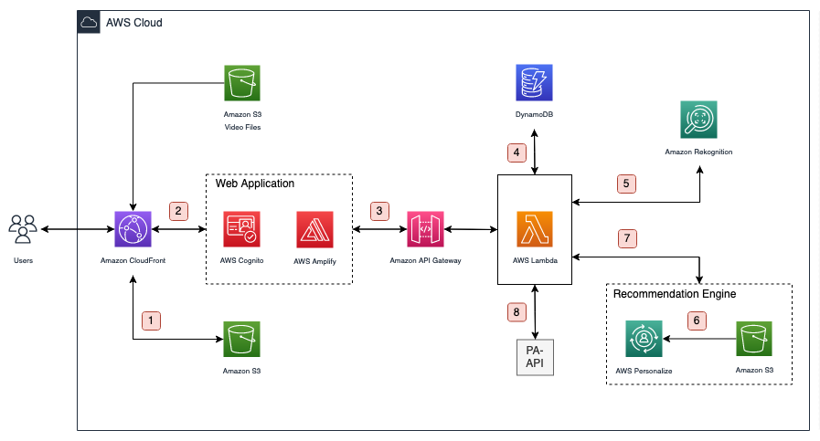

# Shoppable Video

Shoppable Video, a web application is a solution which will let the user take a snapshot of scene in the movie/tv show, mark items/celebrities of interest and analyse the snapshotted frame. Then the solution would display the identified celebrities with details and the list of products available for purchasing on e-commerce sites for identified items. The solution would also recommend movie titles to the user considering user’s interaction with celebrities. The snapshots taken by the user would get added in snapshots library which is a searchable list.

# Tech

Shoppable Video uses a number of cloud resources and open source projects to work properly:

- [AWS Services](https://aws.amazon.com/)
- [ReactJS](https://reactjs.org/)
- [VideoJS](https://videojs.com/)
- [MarkerJS](https://videojs.com/)
- [Node.js](https://nodejs.org/)

# Architecture Overview

The diagram below presents the architecture of Shoppable Video and illustrates the different AWS resources used.



## Workflow

1. The snapshotted frame and selected area of the snapshotted frame for making a lookup request in the application is saved in this [Amazon S3](https://aws.amazon.com/s3/) bucket, which will be later used by [Amazon Rekognition](https://aws.amazon.com/rekognition/) for identifying different objects and also by the application for rendering the snapshot in UI.

1. The [AWS Cognito](https://aws.amazon.com/cognito/) is used for providing sign-up and sign-in options for the application users and [AWS Amplify](https://aws.amazon.com/amplify/) for building the web application.

1. The [Amazon API Gateway](https://aws.amazon.com/api-gateway/) is used to set up API endpoints for serving the client requests with the help of [AWS Lambda](https://aws.amazon.com/lambda/) functions.

1. [AWS Lambda](https://aws.amazon.com/lambda/) stores all the snapshot details in DynamoDB for the users.

1. [AWS Lambda](https://aws.amazon.com/lambda/) function tells Amazon Rekognition for identifying different objects present in the image stored in [Amazon S3](https://aws.amazon.com/s3/) bucket.

1. The metadata for the Dataset group of AWS Personalize is stored in this [Amazon S3](https://aws.amazon.com/s3/) Bucket which is imported to [AWS Personalize](https://aws.amazon.com/personalize/) for creating solution.

1. [AWS Lambda](https://aws.amazon.com/lambda/) function gets the recommendations from AWS Personalize for the users and another [AWS Lambda](https://aws.amazon.com/lambda/) function ingests real-time events using event trackers.

1. [AWS Lambda](https://aws.amazon.com/lambda/) further makes request to PA-API and populates the details of identified objects for the users which is being simulated for few objects with static data for now.

# Source Code

1. Download the automated CloudFormation templates **"shoppable-video.yml"** and **"cloudfront-shoppable-video.yml"** found in **cloudformation-templates**.
2. Push the **"user-engagement-and-monetisation-for-streaming-media-content"** repository to [AWS CodeCommit](https://aws.amazon.com/codecommit/). You can follow links given below for your reference.
- [Introduction to AWS CodeCommit: Setting Up Permissions](https://www.youtube.com/watch?v=W-SM4m19JMA)
- [Introduction to AWS CodeCommit - Part 2: Creating a Repo](https://youtu.be/SWqh7LvxKqI)

# Deployment of AWS Resources

## Launch Stack: shoppable-video.yml

- This cloudformation template will create **ContentsS3Bucket**, **PersonalizeS3Bucket**, **SnapshotsTableDynamoDB**, and **ShoppableVideoAppAmplify**.

1. Go to AWS Console and open Cloudformation.
2. On the Create stack page, select **"Upload a template file"**, upload **"shoppable-video.yml"** and click **Next**.
3. On the Specify stack details page, assign a name **shoppable-video** to your solution stack and click **Next**.
4. On the Configure stack options page, click **Next**.
5. On the Review shoppable-video page, click **Create Stack**.
6. Once the creation of stack is done, navigate to **Outputs** of this stack.
7. You can find **ContentsS3BucketDomainName** which is in the format **"BUCKETNAME.s3.REGION.amazonaws.com"**. Notedown, the **BUCKETNAME**.
8. You'll also find **PersonalizeS3BucketDomainName** which is in the format **"BUCKETNAME.s3.REGION.amazonaws.com"**. Notedown, the **BUCKETNAME**.
9. Additionally, notedown the **SnapshotsTableDynamoDBName** that you'll find there.

## Configure Amplify App

1. Go to AWS Console, open AWS Amplify and navigate to All apps.
2. Click on **ShoppableVideo**.
3. On the Hosting environments page, select **AWS CodeCommit** and click **Connect branch**.
4. On Add repository branch page, select **"The name of the repository you pushed to AWS Codecommit."** in Recently updated repositories. In Branch select **"The branch that you created for your repository."** and click on **Next**.
5. On Build settings page, you must see auto-detected configurations.
6. On Build settings page, select the option of **Enable full-stack continuous deployments (CI/CD)** and for Environment select **Create new environment**.
7. On Build settings page, click on **Create new role**.
8. You will be redirected to Create role page, click on **Next: Permissions**. Then click on **Next: Tags**. Then click on **Next: Review**. After that in Role Name, fill **"shoppable-video-amplify-role"** and click on **Create role**.
9. Go back to Build settings page, click on **Refresh roles** and select **"shoppable-video-amplify-role"** for service role. 
10. On Build settings page, you'll also find **Build and test settings**. Click on **Edit**. Within the Edit build commands pop-up, in preBuild commands at **Line 12** simply add a space-separated **" --legacy-peer-deps"** to the existing command **"- npm ci"** without touching the indentations and close the pop-up. This modification will result in the command appearing as below once applied.
```sh
- npm ci --legacy-peer-deps
```
11. Then click on **Next**.
12. On Review page, click on **Save and deploy**.
13. Now navigate to **General**.
14. You will find **Production branch URL** which is in the format **"https://AMPLIFYAPPDOMAINNAME"**. Notedown, **AMPLIFYAPPDOMAINNAME** whose value is the only part after **"https://"**.

## Uploading Contents to S3 Buckets

- This step is common for all the updation. Go to AWS Console, open Amazon S3. Search the name of the S3 bucket that you noted down in **"Launch Stack: shoppable-video.yml"** process and select the bucket.

### ContentsS3Bucket

1. Unzip and upload all the files found in **ContentsS3Bucket-Contents** folder from the resources to this bucket.

### PersonalizeS3Bucket

1. Unzip and upload all the files found in **PersonalizeS3Bucket-Contents** folder from the resources to this bucket.

## Launch Stack: cloudfront-shoppable-video.yml

- This cloudformation template will create **CloudFront Distribution** and **Personalize related resources**.

1. Go to AWS Console and open Cloudformation.
2. On the Create stack page, select **"Upload a template file"**, upload **"cloudfront-shoppable-video.yml"** and click **Next**.
3. On the Specify stack details page, assign a name **cloudfront-shoppable-video** to your solution stack.
4. Under parameters,
      - AmplifyAppDomainName: Fill the value of **AMPLIFYAPPDOMAINNAME** noted down in **"Configure Amplify App - Step: 14"**
      - ContentsS3BucketDomainName: The value for this parameter will be in the format - **"BUCKETNAME.s3.REGION.amazonaws.com"** where you have to replace the value of **BUCKETNAME** noted down in **"Launch Stack: shoppable-video.yml - Step: 7"** and **REGION** with the region in which your bucket is deployed like **"us-east-1"** for **N. Virginia**.
      - PersonalizeS3BucketName: Fill the value of **BUCKETNAME** noted down in **"Launch Stack: shoppable-video.yml - Step: 8"**.
      - SnapshotsS3BucketDomainName: For this value, go to cloudformation, enable **View nested button** and select **Stacks**. In stacks, search for **storagelookupobjectsstorage** and open this stack (in case you don't find the stack, wait for some time). Navigate to **Outputs**. The value for this parameter will be in the format - **"BUCKETNAME.s3.REGION.amazonaws.com"** where you have to replace the value of **BUCKETNAME** and **REGION** from the output. Also make sure to notedown the value of **BucketName**.
5. After adding values of parameters, click **Next**.
6. On the Configure stack options page, click **Next**.
7. On the Review cloudfront-shoppable-video page, check the option **"I acknowledge that AWS CloudFormation might create IAM resources."** and click **Create Stack**.
8. Once the creation of stack is done, navigate to **Outputs** of this stack.
9. Notedown **CLOUDFRONTDOMAINNAME** whose value is same as **CloudFrontDomainName**.

## Setting up OAI for S3 Buckets

1. Go to AWS Console, open CloudFront and navigate to **Distributions**.
2. Select the distribution with the description **"ShoppableVideo"** and navigate to **Origins**.
3. Select **ContentsS3Origin** and click on **Edit**. In **S3 bucket access**, select **"Yes, update the bucket policy"** option and click **Save changes**.
4. Also for **SnapshotsS3Origin**, follow the same steps mentioned for **ContentsS3Origin** in **Step: 3**.

## Creating Campaign and Event Tracker

1. Go to AWS Console, open Amazon Personalize. Navigate to **manage Dataset groups** and select **ShoppableVideoDSG**.
2. Navigate to **Custom resources** and click on **Solutions and recipes**. Then select **ShoppableVideoSolution**.
3. Click on **Create solution version**. On Create solution version page, fill solution version name as **"v1"** click on **Create solution version**.
4. Once the solution version is created, scroll down and click on **Create campaign**.
5. On Create new campaign page, fill Campaign name as **"campaignv1"** and click on **Create campaign**. Then notedown **"Campaign ARN"**.
6. Navigate to **Event Trackers**, click on **Create event tracker** and fill tracker name as **"analysed"** on Configure tracker page.
7. On Install the SDK page, notedown the **"Tracking ID"**, and click on **Finish**.

## Configuring Environment Variables

## Updating Lambda Functions

- This step is common for all the updation. Go to AWS Console, open AWS Lambda. Navigate to **Functions**. Search the name of the lambda function, you will find the function accompanied with **"The branch name that you created for the repository."** and select the function. Navigate to **Configurations** tab and select **Environment variables**. Now, click on **Edit**.

### Lambda: identifiedobjectslambda

1. Click on **Add environment variable** and add below variables.
| Environment variable Name | Description |
   | --- | --- |
   | LOOKUPOBJECTSS3STORAGE_BUCKET_NAME | The value of the **BucketName** that you noted down in **"Launch Stack: cloudfront-shoppable-video.yml - Step: 4"** while filling the value of SnapshotsS3BucketDomainName parameter.|
2. Click on **Save**.

### Lambda: puteventanalysedlambda

1. Click on **Add environment variable** and add below variables.
| Environment variable Name | Description |
   | --- | --- |
   | TRACKING_ID | The value of the **Tracking ID** that you noted down in **"Creating Campaign and Event Tracker - Step: 7"**.|
2. Click on **Save**.

### Lambda: recommendationscelebidlambda

1. Click on **Add environment variable** and add below variables.
| Environment variable Name | Description |
   | --- | --- |
   | CAMPAIGN_ARN | The value of the **Campaign ARN** that you noted down in **"Creating Campaign and Event Tracker - Step: 5"**.|
2. Click on **Save**.

### Lambda: snapshotslambda

1. Click on **Add environment variable** and add below variables.
| Environment variable Name | Description |
   | --- | --- |
   | TABLE_NAME | The value of the **SnapshotsTableDynamoDBName** that you noted down in **"Launch Stack: shoppable-video.yml - Step: 9"**.|
2. Click on **Save**.

## Updating Amplify App

1. Go to AWS Console, open AWS Amplify and navigate to **All apps**.
2. Click on **ShoppableVideo**.
3. Click on **Environment variables** and then click on **Manage variables**.
4. On Environment variables page, click on **Add variable** twice.
   | Environment variable Name | Description |
   | --- | --- |
   | REACT_APP_CLOUDFRONT_LINK | The format of this value is **"https://CLOUDFRONTDOMAINNAME"** where the value of **CLOUDFRONTDOMAINNAME** is replaced by the value noted down in **"Launch Stack: cloudfront-shoppable-video.yml - Step: 9"**.|
   | REACT_APP_TMDB_API_KEY | The TMDB API key that you can generate for yourself on their [website](https://developer.themoviedb.org/docs/getting-started). |
5. Click on **Save**.
6. Now click on **ShoppableVideo** under All apps.
7. In Hosting environments, click on **Build**.
8. Now, click on **Redeploy this version**.

Now, hit the url **"https://ClOUDFRONTDOMAINNAME"** where the value of **CLOUDFRONTDOMAINNAME** is replaced by the value noted down in **"Launch Stack: cloudfront-shoppable-video.yml - Step: 9"** and use the application. For playing a custom video of your choice, you can upload your video to **ContentsS3Bucket** and enter the name of the video file in the UI.
